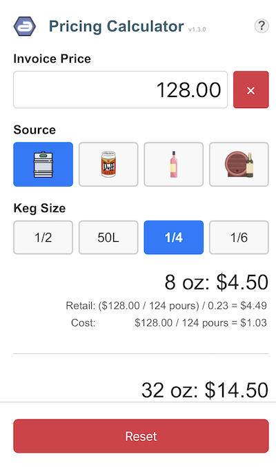
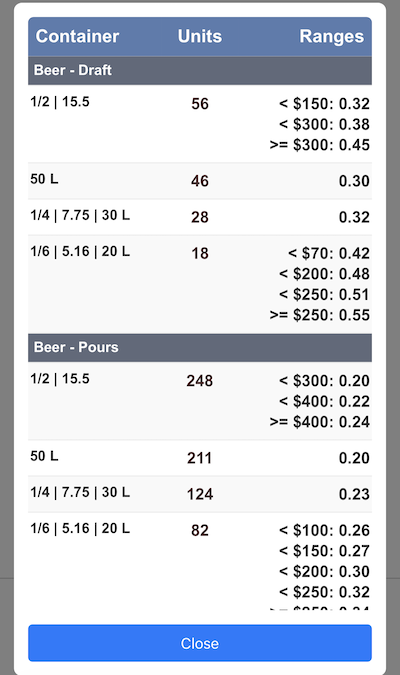

# Pricing Calculator

##
A niche application for quickly calculating retail costs for bottled beer, wine, draft beer and draft wine for a beer market.

## Where?
[https://acidblue.com/pricing](https://acidblue.com/pricing)

## Why?
This is small project I whipped up for friends at a local beer market.

## Installation
This app can be installed on iOS devices as a Progressive Web App. In Safari, tap the Share button and select "Add to Home Screen" to save it to your springboard for quick access.

## Configuration
It has no backend services other than a flat file specifying retail markup in `pricing/js/forumlas`.

